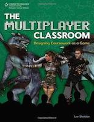

# Introduction

My first introduction to the world of games was on a late-night Ferry travelling to Calais. I was 4 and couldn't/wouldn't sleep, so my Aunt handed me a Gameboy and Tetris to try and tire me out and get me to sleep quicker. In the end, nobody slept, and I discovered a whole new world.

I describe myself as a "Gamer". Someone who has played and enjoyed video games over a period spanning decades, console wars, and hundreds of games. From the addictively simple Tetris, to Massively Multiplayer Online Role Playing Games (MMORPGs), where coordination between dozens of players is required. From highly glossed games to some where the graphics are intentionally low-key. Sagas spanning Galaxies, and tales of Princesses in other castles.

I genuinely love games, and have a particular interest in the underlying mechanics. In recent years, the word "Gamification" has become widespread,
especially amongst marketting teams. Here, I take an overview of where it comes from, what it means, and how it might be useful to you.

Online, I am "Kazenone66", and primarily play on [Xbox Live](http://live.xbox.com/en-US/profile/profile.aspx?GamerTag=Kazenone66). If you want to find out what kind of games I play, I track my [stats](http://www.trueachievements.com/gamerstats.aspx?gamerid=300795) online, with a good dose of meta-gaming.

## Further Reading

This book is only intended as a short introduction to Gamification. There are plenty of other great resources out there which delve into much deeper detail. Two books I would personally recommend are [Game of Work](http://www.amazon.co.uk/Game-Work-Enjoy-Much-Play/dp/1423630858/) by Charles Coonradt, and [The Multiplayer Classroom](http://www.amazon.co.uk/The-Multiplayer-Classroom-Designing-Coursework/dp/1435458443) by Lee Sheldon.

### Game of Work

In "Game of Work", Charles Coonradt relates his experiences in the industry for a number of large and small businesses. In particular, he encourages that scores be kept, that they are easily understandable, easily available, and that feedback is frequently given. In turn, this encourages the players to maximise their score, while teaching them the best way to do so.

### The Multiplayer Classroom

The Multiplayer Classroom is much more focused on applying Gamification to education, however still has much to say about the subject in general. Lee Sheldon relates his experiences as a Professor and Game Designer, applying ideas such as experience points and quests to coursework and learning. Even the book itself is gamified, with levels instead of chapters!

