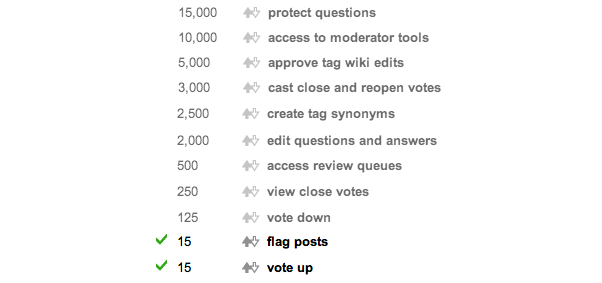

# A Challenger Appears

On the flip-side of cooperative games are games where players are pitted against eachother, where only one may be the champion. This encourages players not only to be the very best (like no-one ever was), but to do better than their peers. As the other players become stronger, so must you.

### Foursquare

On the surface, Foursquare is a very simple premise; players can "check in" at any location within a short distance of their GPS coordinates, telling the world where they are and where they've been. Players are awarded badges for completing small objectives, such as "checking in" (registering your presence at a location) a set number of times, or becoming the user to check in the most times over the past 2 months at a location; earning the player the title of "Mayor".

Becoming the Mayor is a big deal in Foursquare. Sometimes this is just for bragging rights, but some locations will offer the Mayor special deals. Starbucks offers the mayor a free coffee on wednesdays (and some stores will even call the Mayor by their title!), Pizza Hut also offers free pizzas once a week to their Mayor, and some American malls have specially reserved parking spaces for the current mall mayor.

### Stack Overflow

StackOverflow is another system which on the surface seems very simple. Users ask questions, and other users provide answers. Both questions and answers are given votes for their usefulness and relevance.

As players receive votes, they are awarded points. These points can unlock other priviledges on the site, including moderator abilities.

Players can also spend some of their accumulated points to vote down an answer which they consider bad enough, or to post bounties (offering points for the best answer). Bounties in particular can be very competitive, as only one user can earn the substantial boost in points.

### The Continuous Integration Game

The [Continuous Integration Game](https://wiki.jenkins-ci.org/display/JENKINS/The+Continuous+Integration+Game+plugin) is a plugin for Jenkins which scores each build. The rules are configurable and extendable, but by default points are awarded or removed for;

* Breaking the build (-10)
* Breaking a broken build (0)
* Build with no test failures (+1)
* New test failures (-1 each)
* New passing tests (+1 each)

The plugin maintains a leaderboard of each submitter, giving immediate feedback as to how you are performing compared to your peers.

Players are encouraged to write more tests, and make sure everything works before committing to the shared source control, as well as making small, frequent commits.
