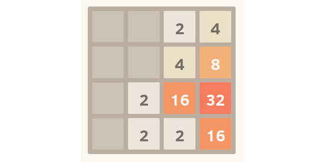
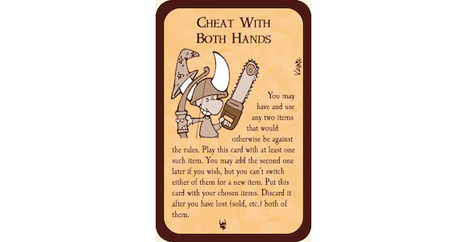
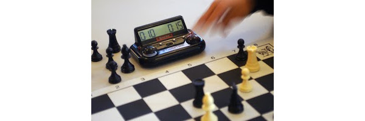
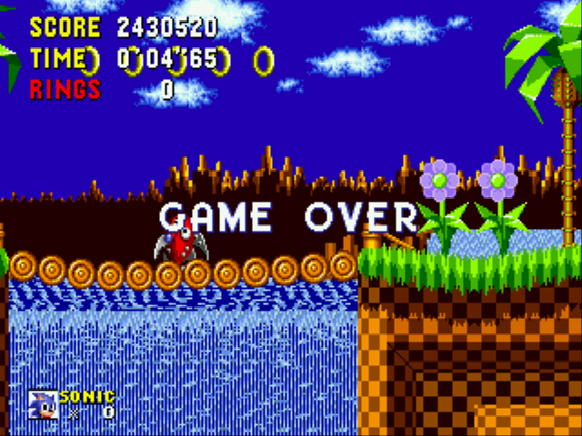

# Bit of Background

To start with, what is Gamification? Taking straight from the Oxford English Dictionary, Gamification is:

>*The application of `typical elements of game playing` to other areas of activity, typically as an online marketing technique to `encourage engagement` with a product or service.”*

So how do we encourage engagement and motivate people? Motivation can (very loosely) be broken down into two types; Internal (or Intrinsic) and External (or Extrinsic) Motivation.

## Motivation

*Internal Motivation* is motivation from within. This is motivation through having a vested interest in the task at hand. This could be because of a hobby or passion for the task.

*External Motivation* is motivation from outside forces. This is often by being told to do something, the reward of completion of the task, or the punishment for failure to complete the task.

Both forms of motivation are important. Internal motivation is a much stronger force than External motivation, but also more fragile. If you keep hitting a wall while trying to accomplish a task, the repeated failures can be demoralising and cause you to lose the passion for the task. On the other hand, External motivation is much less likely to go away, but is not as strong as Internal motivation, particularly if you want to do something which doesn't align with the outside forces' desired outcome.

External motivation can also be the demoralising factor which lessens the Internal motivation, especially when it comes to failure mechanics. Imagine that every time you were handed a task at work, you get told "If this isn't done by the end of the day, you're fired". Even if you complete each task on time, you would still feel worse about it than if nothing had been said at all.

## Gaming Motivation

So how do game mechanics relate to motivation? A lot of the mechanics can be broken down into the two categories;

**Internal Motivation from Games**

* Points and Score
* Leaderboards
* Achievements and Challenges
* Plot

Scores, points and leaderboards encourage you to "be the best" and beat your high score, or compete against another player to beat their score. This closely ties in to levelling systems in games, where as you accumulate experience points, you level up.

"2048" is a very simple version of this, where you have to match up tiles to combine their value without running out of space, while trying to get the 2048 tile.

Your score is the total value of each of the tiles on the board, and your level is considered to be the highest-value tile on your board. When comparing scores, players tend to talk a lot more about the highest tile they reached, rather than the scores they gained.

Challenges and Achievements offer goals and tasks for the player to work towards, sometimes set by the game, and sometimes by the player.

For example, "Metal Gear Solid" has a ranking system given at the end of the game. The better you do at certain aspects of the game each determines part of your rank. The top rank obtainable is "Big Boss" rank, which requires players to;

- Complete the game on the hardest difficulty level
- Complete it in 3 hours or less
- Use no continues, or health restoring rations
- Kill 25 or less enemies
- Never get spotted by an enemy (except where the plot demands it)
- Save 80 times or less

The best kind of achievements or challenges are those which ask players to play the game in a different way from the way they would normally. For example, not killing any enemies, playing on the harder difficulties, or searching every corner of the world for collectables and extra background information.

Plot is a mechanic shared by any medium of storytelling, be it books, movies, or anecdotes. If the player enjoys the plot, they will want to know what happens next, and how everything will work out in the end.

**External Motivation from Games**

* Rules of play
* Time limits
* Unlockable content
* Money
* Failure mechanics

Rules of play are the basic rules of how the game works; what is and isn't possible, and how to win. These rules can either be strictly enforced, or there can be punishments for breaking them.

For example, chess moves are strictly defined. A knight move in a very specific way, you cannot take your own pieces, and the king cannot move into check. You win if the opponent is unable to move out of check, or surrenders.

Sometimes the rules are less strict. A dungeon-crawling card game called "Munchkin" encourages players to fight amongst themselves more often than against the monsters they are fighting. A common house-rule many players adopt is:

>*Cheating is allowed, until you get caught.*

This even made it into the rules of the cards!

A common enforcement rules in a lot of games is to add a time limit, either on a single player's turn, or the game itself. Chess clocks give each player a set amount of time to perform their moves. When it is the player's turn the clock ticks down, and pauses when it is the other player's turn. Making a move means your clock stops, and the other players' clock starts again.

The time limit does not always need to be an exact clock. The game may increase in difficulty periodically, forcing the players towards a conclusion. This is common in poker tournaments where the initial blinds are increased at set intervals, forcing players to bet larger amounts or go all-in if they cannot meet the blind otherwise.

As a reward for following the rules through to the completion of the game, the player might win money or other prizes. Unlockable content especially gives a reward for completing certain challenges, and has become a staple of fighting games like Tekken and Super Smash Bros.

On the flip side of the rewards for completion are punishments for failure to complete a task. This may be a small penalty, such as a reduction in points or lives, or forcing the player to take a more difficult route towards the goal. It might be an instant failure such as a "Game Over" screen, or an "Insert Credits to Continue" screen from an arcade machine.

