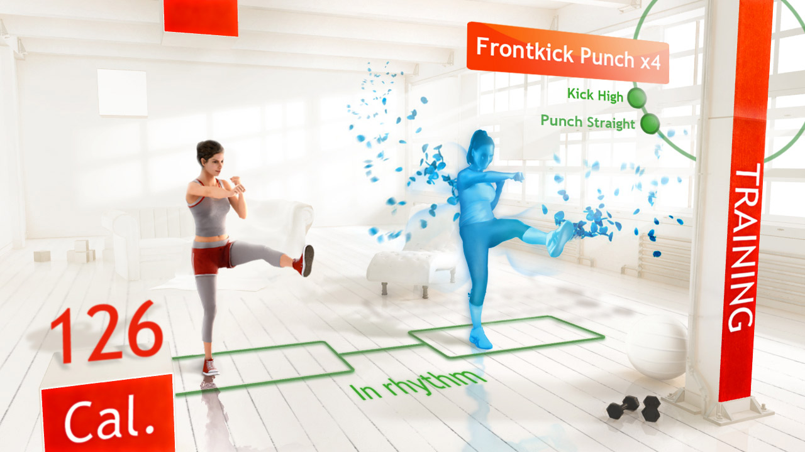
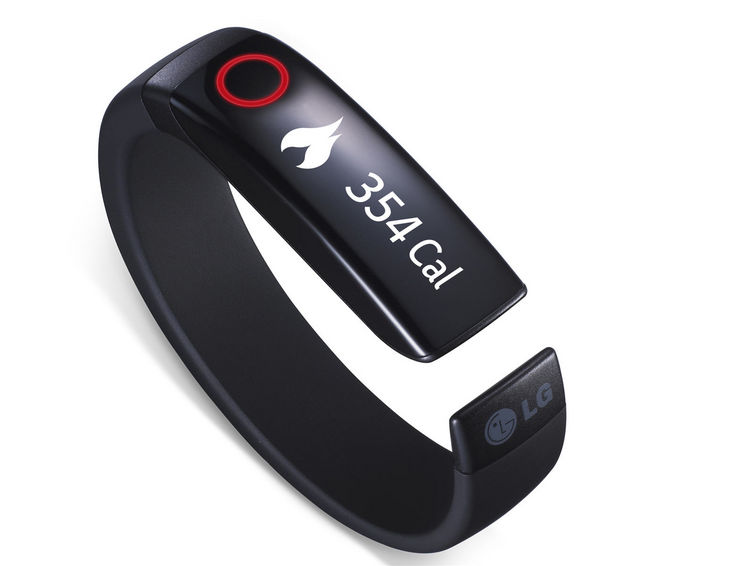
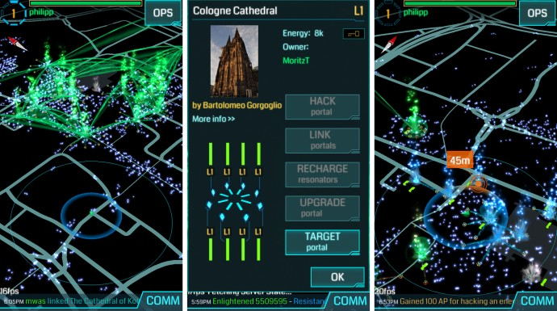

# Extra Life

A recent trend of fitness games has emerged, with the popularity of games such as Wii Fit and Zumba, as well as the addition of motion controls to all of the major consoles. Applying game mechanics to exercise and fitness has become known as "Exergaming".

These games allow a unique take on exercise by quantifying weight loss and fitness in measurable results which can be compared over time. Your form and technique can be assessed and scored, offering immediate feedback on how you are doing, and how you can improve yourself.

Often these games use a levelling system, where performing the lower-level activities rewards you with new content and difficulty levels. In reality, this is helping you slowly scale up the amount of exercise you are doing at a reasonable pace. Expecting a player to immediately run 25 miles on the spot after opening the box would be unreasonable, but having them get used to running one mile on three consecutive workout sessions to unlock 2 miles or 5 miles stops the player working themselves too hard or becoming demoralised at unsurmountable obstacles and losing interest too quickly.

### Taking Exergaming outside

Exergaming is currently undergoing a dramatic shift, as wearables are becoming much more popular and better equipped with sensors and screens. SmartWatches are promoting their health apps, allowing tracking of anything from footsteps and running speed to heartrate and even glucose levels, just from being strapped to the wrist.

In particular, the Nike Fuelband, the iWatch and the Galaxy Gear are all trying to capitalise on the emerging market.

More towards the game side, games developers are also trying to get players to care about their health more. The Nintendo 3DS features a coin system which a variety of games accept for in-game purchases. To earn a single coin, players must walk 100 steps for up to 10 coins per day.

A number of smartphone Apps encourage gamers to take over their city (in-game) by exploring it. Google released an augmented reality game called [Ingress](www.ingress.com) where players are divided into two teams competing for control of regions; the Resistance and the Enlightened. By being close enough to a landmark around the city, players could try and take over the area by destroying the enemy's portal defences and building their own defences in its place.

### Neurobic Exercise

Mental fitness can be just as important as physical health. In a similar genre to Exergaming, puzzle games have also been gaining popularity in recent years.

Some of these games are just sets of puzzles and challenges, such as the Dr. Kawashima's Brain Training series and Big Brain Academy series, while others wrap the puzzles in a story, such as the Professor Layton series

These games pose math problems, logic problems, and brain teasers to the player, and get the player thinking quickly or deeply about the puzzle, exercising different parts of the brain. While the exact scientific benefits of the some of the games is not established, researchers have found that keeping the brain active can maintain brain health, and reduce the risk of the early onset of Alzheimer's disease and dementia.

The games have proven to be a lot of fun too! Professor Layton has sold over 15 million games, with Metacritic giving scores between 75% and 86% to the series. Likewise, Big Brain Academy has sold over 5 million games, and Dr. Kawashima's Brain Training has sold over 20 million games.
