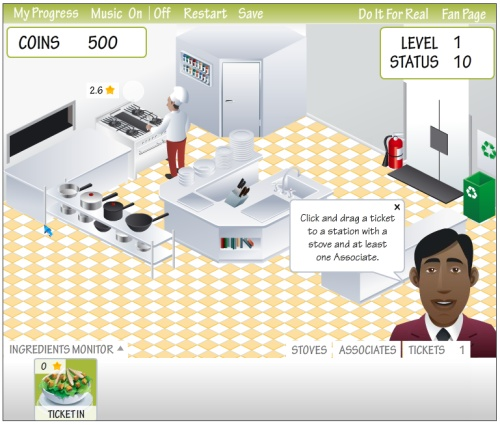

# Game Over

Above all, games need to provide real-time feedback to players, as well as goals to achieve. However not every attempt at gamification has managed to do this.

### Google News

In Late 2011, Google News introduces badges to their news feed. When players read a news article, they were sometimes presented with a badge to appear on their profile.

Some gamers wanted to rise to the challenge and collect every badge they could. There was just one problem; nobody knew how to do it. Google refused to release an official list of all of the badges or requirements, but players managed to track over 500 different types of badges.

The badges also had no meaning to the players. They could not be exchanged for anything else, and were not seen as an indication of effort, just luck. Because of this, many readers shunned the idea of the badges, and they were finally removed in Late 2012.

Had these badges been more open to the players about how much effort was required they might have been seen as more worthwhile, being similar to the badges earned by the Scouts for fire making and safety skills or rope skills.

### Marriott Hotel

Another from 2011, the Marriott Hotel group wanted to expand its workforce and hire 50,000 new employees. To do this, they created "My Marriott Hotel"; a Facebook Game similar to Farmville and Restaurant City. Players were tasked with overseeing every aspect of the hotel, starting in the kitchen.

The game was seen as unpolished and slow, with players in the demo having to stare at a progress bar of food cooking for 20 seconds without anything else to do. After food was cooked, players had to "inspect for quality" and choose whether to re-cook the food or send it out.

Players quickly became bored of the game and stopped playing; the entertainment factor was missing. The Marriott Hotel Group had previously promised to add other chapters to the game, but ultimately dropped the idea entirely.

