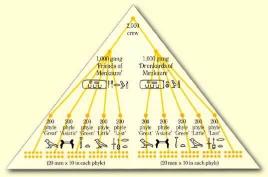

# Games for Life

"Gamification" is a relatively new term, coined by Nick Pelling in 2002. However the idea of turning work into games is much older.

Even as far back as the building of the Great Pyramid of Giza, there is evidence of a lot of the typical elements. Setting aside a common myth for a moment, the builders were not slaves but common workers and devout believers in their god-like pharoah. The Pyramids themselves were viewed as a National Project, and the workers had a lot of pride in their work.

The workers were [divided into two gangs](http://www.touregypt.net/featurestories/pyramidworkforce.htm); the "Drunkards of Menkaure" (green), and the "Friends of Menkaure" (red). Each gang was responsible for building half of the Pyramid, and were subdivided into 5 Phyles, which themselves were split into teams of 10-20 men.

The gangs competed against eachother to be the fastest builders, and there was competition within the gangs amongst phyles, and within phyles amongst teams. Each group competing for the pride of being the better group.

Since then, the idea of using fun and games to encourage work has been used across many areas. To quote Mary Poppins;

>*In every job that must be done, there is an element of fun.*
>
>*You find the fun and snap, the job's a game!*

### Level up

The Boy Scouts of America have a rank system scored on the number of merit badges, as well as service, leadership and "Scout Spirit". Each rank has a unique badge, starting at "Scout", through to "Tenderfoot", "Second Class", "First Class", "Star", "Life" and finally "Eagle".

Each rank has an exact set of requirements to aim towards including earning merit badges (achievements), doing community service (quests), as well as having completed all requirements for the previous rank (level progression). This system has seen over 2 million young men achieve Eagle Scout rank since its introduction in 1911.

### Loyalty Stamps

In 1896, Sperry & Hutchinson introduced S&H Green Stamps as one of the first loyalty schemes. Stamps were given to customers at the checkout of their supermarkets, department stores, or gasoline stations. These stamps could then be redeemed for items in their rewards catalogs.

The success of Green Stamps was so great, that at its peak in the 1960s, S&H were printing three times as many stamps as the US Postal Service. They tapped into what is now a common marketing strategy; that small rewards inspire brand loyalty.

Today, Americans alone have over 2.6 billion loyalty program memberships, with 22% of households holding a card (of which around half are active).

### The Great Brain Experiment

The Great Brain Experiment is a project set up to perform neuroscience research in a fun and engaging way. In July 2014, the [first results](http://thegreatbrainexperiment.com/firstpublications) were released which showed an overwhelming level of success for the collection of data.

The experiments performed tested memory, impulsivity, risk-taking and happiness. Instead of performing these tests in a lab with a handful of volunteers, the researchers created a game for each test and bundled them together as part of an app.

The researchers posited that the large number of smartphones would allow them to investigate variability in the population which would not be possible at a laboratory scale. During the first phase of the experiment, 60,000 participants submitted anonymous data, with their performance, age and level of education.
