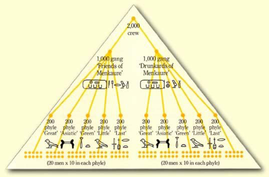

# Games for Life

## Gaming History

"Gamification" is a relatively new term, coined by Nick Pelling in 2002. The idea of turning work into games is a much older idea though.

Even as far back as the building of the Great Pyramid of Giza, there is evidence of a lot of the typical elements. Setting aside a common myth for a moment, the builders were not slaves but common workers and devout believers in their god-like pharoah. The Pyramids themselves were viewed as a National Project, and the workers had a lot of pride in their work.

The workers were [divided into two gangs](http://www.touregypt.net/featurestories/pyramidworkforce.htm); the "Drunkards of Menkaure" (green), and the "Friends of Menkaure" (red). Each gang was responsible for building half of the Pyramid, and were subdivided into 5 Phyles, which themselves were split into teams of 10-20 men.

The gangs competed against eachother to be the fastest builders, and there was competition within the gangs amongst phyles, and within phyles amongst teams. Each group competing for the pride of being the better group.

