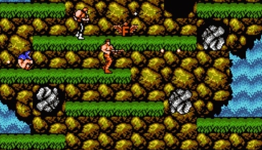
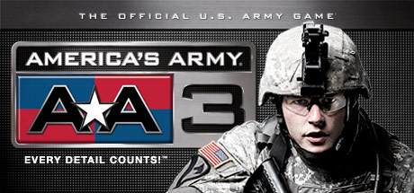

# Player Two

Not all games are single-player. Adding another player to a game can completely change the style of the game, either making it more competitive or co-operative.

When video games first began to take off, games would either be single player or have alternating players. The hardware restricted having two player-controlled characters on screen at once for many genres. When the hardware began to improve, co-op games started to allow a pair of players to fight against waves of enemies, in "Run and Gun" games such as Contra.

To balance out the bonus from doubling the forces on one side, there would often be penalties for neglecting your teammate. Enemies might be stronger and require both players to beat them, or you could be confronted with a GAME OVER if one of the players is killed, even if the other was still going strong.

This forces players to bond together towards a common goal; an incredibly powerful mechanic in gamification.

### Foldit and M-PMV

In 1996, scientists discovered the makeup of a protein called M-PMV; believed to be a HIV-inhibiting protein, found in monkeys. While they knew the composition of the protein, they struggled to pin down the exact 3D shape.

Skip forward 15 years to 2011, where the scientists still had not discovered the 3D shape of the protein yet. The protein was submitted to the game "Foldit", which gives points for successful tweaking of the shape of the molecule, and a deadline of 3 weeks set for the community to find the shape.

Over the following 10 days, a community of 46,000 players collaborated together, sharing information to find the structure. They finished the task in under half of the allotted time for the challenge, successfully solving a problem which for 15 years had eluded the much smaller scientific team.

This was only made possible through the collaboration of the players, and the immediate feedback they were given on their task through buttons which allowed them to test their current structure by "wiggling the protein". This wiggling gave a visual demonstration of the underlying mechanics, where the protein tries to exist in its most stable format at the lowest level of potential energy. Through this mechanism, players with no formal training could easily participate in what would otherwise be a hugely complicated task.

### America's Army

The first few weeks of training in the US Army can be a shock to the system for many new recruits, and a significant number drop out during the first few weeks of Drill Sergeants, 4am starts to the day, and 5-mile runs through rain and mud.

Colonel Wardynski thought this number could be reduced drastically with proper preparation, and had the "America's Army" project approved to turn the army experience into a video game. His mission objective was simply;

>*Using computer game technology to provide the public a virtual Soldier experience that was engaging, informative and entertaining.*

The game introduced players to the training they would need to do, including Drill sergeants, gun safety, and tactics training. It encouraged the army motto of "No man left behind", and discouraged applicants who wanted to be Rambo.

The game turned into a franchise, with 41 different versions and updates across multiple platforms being released, including an arcade machine version which was installed in a number of army recruitment offices. In total, 13 million players have registered across the series, clocking 260 million hours of gameplay.

The game was credited by the Army in a statement to Congress as being "more effective than any other method of contact" when recruiting. A survey in 2008 from MIT found that 30% of Americans aged 16-24 had a more positive impression of the Army as a direct result of the game, and that the game itself was more effective than all other forms of army recruitment combined.

Importantly, America's Army did not re-invent the wheel. They used existing platforms (PC and console games) to build it, and took their time building it. The initial game was released with 3 years of development, and feedback gathered by the recruiters was used to improve the next game in the series over the following 6 years.
